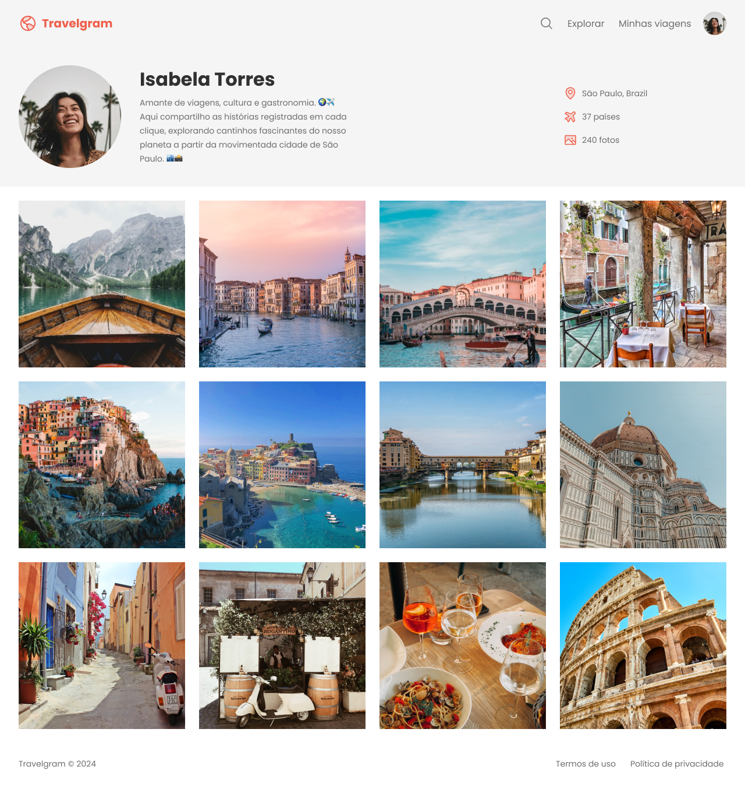

# Travel Profile

A simple travel page using HTML and CSS.

     <a href="https://perfil-de-viagens-kts.netlify.app/">📱 Visit this Project</a> 
     <a href="https://www.figma.com/design/KRpL6vY12IjmiHI5Gt6c7L/Perfil-de-viagens-(Community)?node-id=3-376&p=f&t=WhkWNpff9MMLnx8B-0">🎨 Figma</a>

    

## Tech Stack

